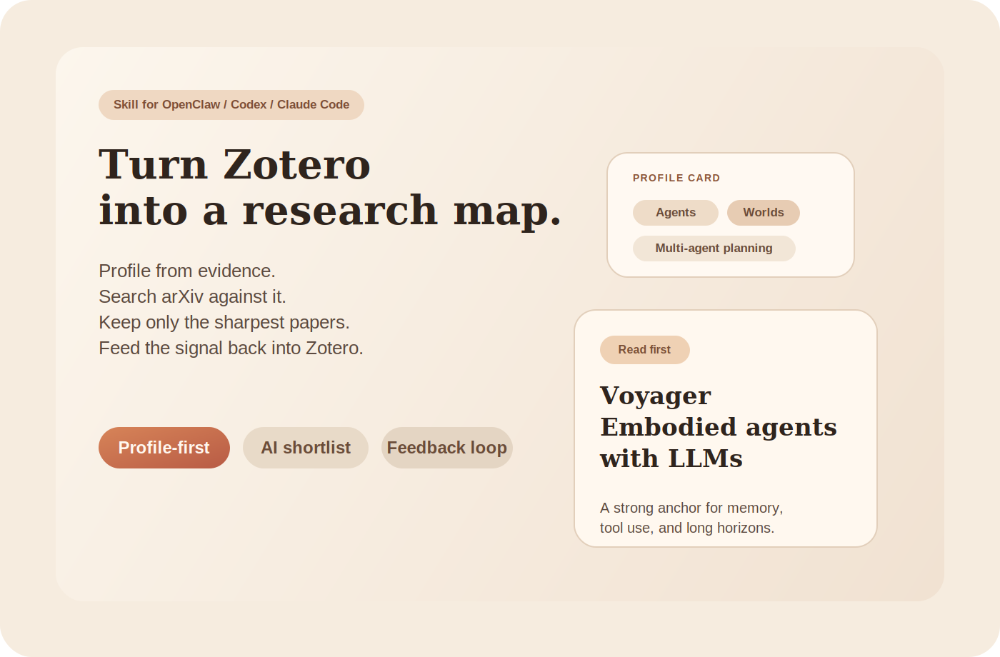
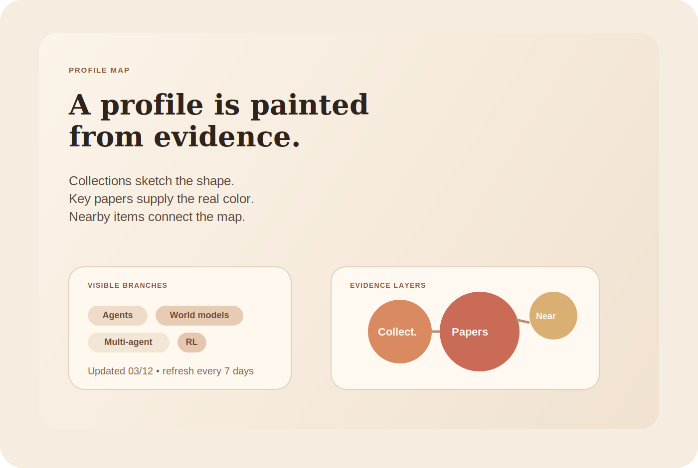
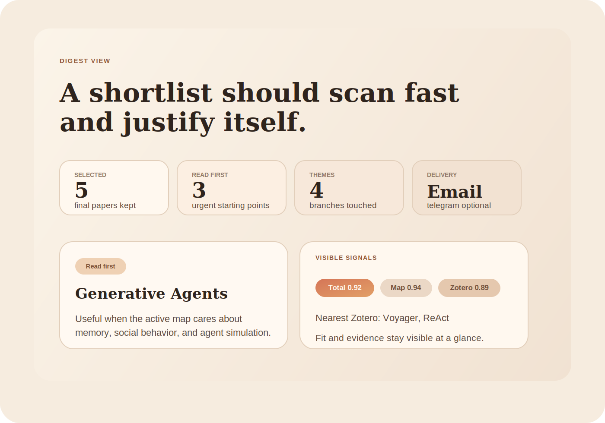
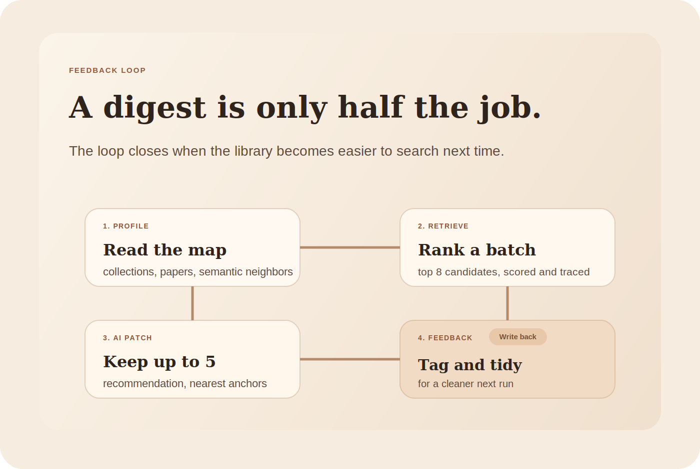

# research-assist

> 把 Zotero 文库摹绘成一张研究地图，用这张地图去筛 arXiv，让 AI 留下真正值得读的少数论文，再把判断回写到 Zotero。

<p align="center">
  
</p>

<p align="center">
  <a href="README.md"><strong>English</strong></a>
  ·
  <a href="SKILL.md"><strong>SKILL</strong></a>
  ·
  <a href="references/workflow.md"><strong>工作流</strong></a>
  ·
  <a href="references/contracts.md"><strong>契约</strong></a>
  ·
  <a href="references/setup-routing.md"><strong>安装路由</strong></a>
</p>

<p align="center">
  <code>Zotero 驱动画像</code>
  <code>OpenClaw 可用</code>
  <code>Agent 参与推荐</code>
  <code>邮件主推送</code>
  <code>反馈可回写</code>
</p>

## 它吸引人的地方

- **不是从关键词开始，而是从你的文库开始。** 文件夹结构、代表论文、语义近邻会一起参与画像生成，最后得到的是一张可检索、可解释的研究地图。
- **目标不是抓更多，而是留下更准。** 系统可以先广泛召回，再把最终 digest 收敛成少量真正值得读、值得收、值得整理的论文。
- **AI 推荐是工作流的一部分。** 宿主 agent 会补全推荐理由、Why it matters、Zotero 对照、注意事项，以及最后是否进入 digest。
- **判断会回流到 Zotero。** 标签、分组归档、非破坏性整理都可以回写，让下一次检索从更干净的文库出发。

## 视觉示意

<p align="center">
  
</p>

好的画像应该像地图：分支紧凑、别名清楚、每个区域都能追溯到文库证据。

<p align="center">
  
</p>

好的摘要应该像看板：一眼能扫，想深入时又能展开到推荐理由、分数和近邻证据。

<p align="center">
  
</p>

反馈回路重要，是因为好的 digest 不只是推荐论文，还会让下一轮文库更容易被检索和整理。

## 四个核心亮点

### 1. 画像不是提词，而是作画

`research-assist` 把 Zotero 当成颜料盘来处理：

- collection 提供轮廓
- 代表论文提供主色
- semantic neighbors 把邻近主题自然过渡起来

这样得到的 profile 既忠于文库，也真的能拿来检索。

### 2. 检索可以宽，digest 必须尖

一个实用的模式是：

- 先抓更大的候选集
- 排到 top 8
- 再让 agent 最终保留 `<= 5`
- 只渲染最后真正值得看的几篇

这能避免“召回很多，但用户不想看”的常见问题。

### 3. 推荐理由是有根据的

agent 只负责补论文级 review，不负责乱改系统外壳。它主要填写：

- `recommendation`
- `why_it_matters`
- `quick_takeaways`
- `caveats`
- `zotero_comparison`
- `selected_for_digest`

这样它专注判断，渠道包装仍由系统模板统一控制。

### 4. 反馈会真正改善下一轮

review 之后，可以把非破坏性的整理动作回写到 Zotero：

- 加 tag
- 加入或移动 collection
- 追加 note
- 先 `dry_run` 再决定是否真实执行

这使它不只是“生成一封摘要”，而是“逐步把文库整理得更好”。

## README 图里使用的示例画像

这些分支只用于 README 视觉示意，不代表任何真实用户方向：

- Agent memory
- Multi-agent planning
- World models
- RL systems
- Tool use
- Simulation

## README 图里使用的示例论文

这些都是真实论文，但这里只作为中性展示素材：

- [ReAct: Synergizing Reasoning and Acting in Language Models](https://arxiv.org/abs/2210.03629)
- [Generative Agents: Interactive Simulacra of Human Behavior](https://arxiv.org/abs/2304.03442)
- [Voyager: An Open-Ended Embodied Agent with Large Language Models](https://arxiv.org/abs/2305.16291)
- [Mastering Diverse Domains through World Models](https://arxiv.org/abs/2301.04104)
- [Multi-agent Reinforcement Learning: A Comprehensive Survey](https://arxiv.org/abs/2312.10256)
- [A Survey on LLM-based Multi-Agent System: Recent Advances and New Frontiers in Application](https://arxiv.org/abs/2412.17481)

## 快速开始

### 1. 安装依赖

```bash
uv sync
```

### 2. 准备一次性的 skill 配置

```bash
mkdir -p ~/.openclaw/skills/research-assist/profiles
mkdir -p ~/.openclaw/skills/research-assist/reports

cp config.example.json ~/.openclaw/skills/research-assist/config.json
cp profiles/research-interest.example.json \
  ~/.openclaw/skills/research-assist/profiles/research-interest.json
```

如果你希望由宿主 agent 交互式完成安装配置，让它遵循 [`references/setup-routing.md`](references/setup-routing.md) 的顺序，直接修改 `~/.openclaw/skills/research-assist/config.json`。

这里有三个重要约束：

- 安装和重配置是**一次性任务**
- 一旦 `config.json` 可用，正常 digest 运行时**不应该反复重新提问安装项**
- 只有在用户明确要求重配，或配置缺失时，才重新进入 setup

### 3. 只在需要时配置 Zotero 与语义搜索

最小 digest 模式并不强制要求 Zotero 凭据。

如果你要启用基于 Zotero 的画像刷新和语义近邻，需要填写这些配置：

- `zotero.library_id`
- `zotero.library_type`
- `zotero.api_key`
- `semantic_search.zotero_db_path`
- `semantic_search.local_group_id` 或 `semantic_search.local_library_id`

首次建立本地语义索引：

```bash
uv run python - <<'PY'
from codex_research_assist.zotero_mcp.semantic_search import create_semantic_search

search = create_semantic_search()
print(search.update_database(force_rebuild=False))
PY
```

### 4. 运行主流程

```bash
# 完整 digest
uv run research-assist --action digest --config ~/.openclaw/skills/research-assist/config.json

# 临时搜索
uv run research-assist --action search --query "llm multi-agent planning" --top 5

# 检查画像刷新策略
uv run research-assist --action profile-refresh --config ~/.openclaw/skills/research-assist/config.json

# 在 agent patch merge 后重新渲染最终 digest
uv run research-assist --action render-digest \
  --config ~/.openclaw/skills/research-assist/config.json \
  --digest-json path/to/digest.json \
  --format delivery

# 启动内置 Zotero MCP
uv run research-assist-zotero-mcp
```

## 六阶段链条

1. `profile_update`
   读取 Zotero 证据，维护紧凑研究画像。
2. `retrieval`
   检索 arXiv、去重、生成候选 artifacts。
3. `zotero_evidence`
   为候选补 exact / semantic 锚点。
4. `agent_patch`
   让宿主 agent 填 review 与最终保留决策。
5. `render`
   从最终入选集合生成 HTML、邮件或 Telegram 输出。
6. `feedback_sync`
   把非破坏性的整理动作回写到 Zotero。

## 边界

- 宿主 agent 只应该填写 `candidate.review`
- 宿主 agent 不应该改 `candidate.paper`、分数、溯源字段和渠道外壳
- 邮件标题/正文、Telegram 外壳、统计卡、画像卡、渠道路由都属于系统模板
- 默认主通道是 email，Telegram 是备选或回退通道
- Zotero 写回默认应先 `dry_run=true`

## 建议继续读

- [`SKILL.md`](SKILL.md)：OpenClaw 侧使用契约
- [`references/workflow.md`](references/workflow.md)：阶段顺序与 controller 边界
- [`references/contracts.md`](references/contracts.md)：profile / review / delivery 的 ownership
- [`references/review-generation.md`](references/review-generation.md)：agent patch 约束
- [`references/profile-map-generation.md`](references/profile-map-generation.md)：如何把 Zotero 证据摹绘成研究地图
- [`references/zotero-mcp.md`](references/zotero-mcp.md)：内置 Zotero 工具说明
